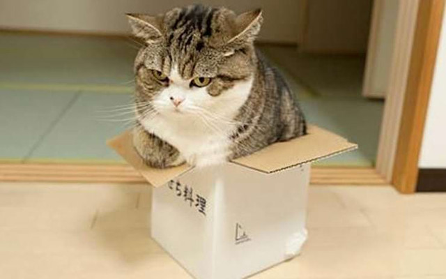
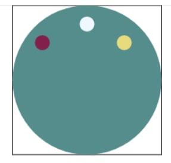
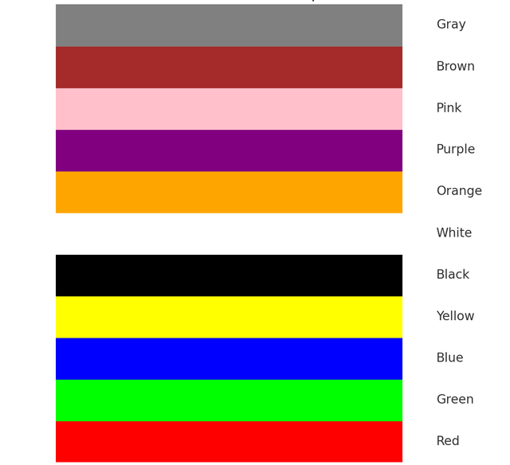
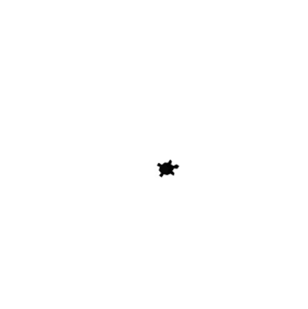

# 🐢 Python Interactive & Animation Playground


## 📌 Sobre o Projeto

O **Python Interactive & Animation Playground** é um laboratório criativo desenvolvido para explorar as capacidades da linguagem Python na criação de soluções visuais, animações gráficas e mini-jogos. Este repositório reflete uma abordagem prática para a resolução de problemas de lógica, movimentação espacial e gerenciamento de eventos através de código.

Os projetos aqui contidos foram construídos com foco na modularidade, permitindo a transição da lógica procedural para estruturas mais organizadas, utilizando bibliotecas gráficas consagradas no ecossistema Python.

---

## 🎨 Galeria de Recursos

A identidade visual dos projetos é sustentada por assets dedicados que permitem a composição de cenas dinâmicas:

<div align="center">
  
  
  
  
</div>

---

## 📂 Estrutura do Repositório

O projeto está organizado de forma a separar a lógica de execução dos recursos visuais, otimizando o fluxo de manutenção:

```text
/
├── Python/
│   ├── assets/              # Diretório de recursos (Imagens, Sprites, Ícones)
│   ├── attention-cats.py    # Demonstração de animação com assets
│   ├── labirinth.py         # Lógica de pathfinding e controle de estado
│   ├── robot.py             # Automação de entidade e movimentação
│   ├── turtle.py            # Arte vetorial procedural
│   └── ...                  # Scripts complementares de lógica e automação
└── README.md

```

## 🚀 Guia de Instalação e Execução

Siga os passos abaixo para preparar o seu ambiente e executar as animações localmente.

### Pré-requisitos

* **Python 3.x** instalado.
* Biblioteca **Pygame Zero** (`pgzero`).

### Passo a Passo

1. **Clone o repositório:**

```bash
git clone https://github.com/jeffthedeveloper/python-4-chd.git

```

2. **Acesse o diretório do projeto:**

```bash
cd python-4-chd/Python

```

3. **Instale as dependências:**

```bash
pip install pgzero

```

4. **Execute os exemplos:**

* **Para scripts de arte (Turtle):**
```bash
python turtle.py

```


* **Para scripts com Pygame Zero (Ex: Robot, Labirinth):**
```bash
pgzrun robot.py

```


## 🏁 Desfecho

Este conjunto de aplicações demonstra a capacidade técnica de traduzir a lógica computacional pura em resultados visuais concretos. Através da interação entre componentes gráficos e fluxo de controle, este repositório apresenta o potencial para o desenvolvimento de soluções dinâmicas e responsivas, mantendo um código organizado e estruturado para futuras expansões.

---

*Desenvolvido por [Jefferson Firmino](https://github.com/jeffthedeveloper).*

```

```
